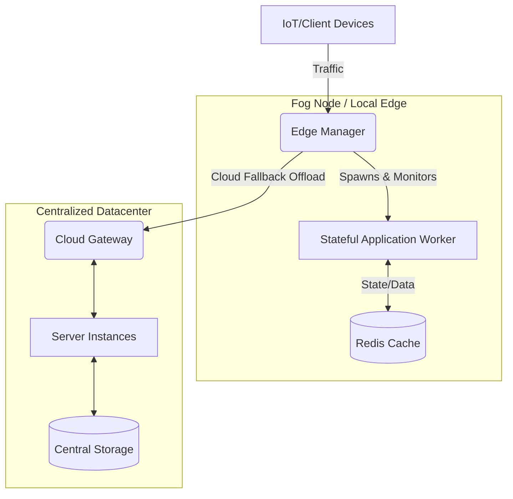

# ENORM: Edge Node Resource Management

**A Framework for Evaluating and Simulating Fog vs. Cloud Computing Performance**

ENORM is an experimental simulation framework developed to benchmark, trace, and empirically demonstrate the performance advantages of Edge/Fog architectures over traditional centralized Cloud computing. This repository serves as the practical implementation for corresponding research evaluating latency, resilience, and state migration in distributed computing topologies.

---

## 1. Abstract & Introduction

As the Internet of Things (IoT) expands and real-time applications (autonomous vehicles, competitive gaming, industrial control) become more demanding, traditional Cloud computing faces fundamental limitations purely due to geographic latency and core network congestion. 

**Fog Computing** extends the Cloud by pushing computation, storage, and networking resources out to the "Edge" of the network, nearest to the generating devices.

This project, ENORM, simulates a fully functional Edge Environment—complete with resource allocators, stateful workload offloading, and geographically roaming hand-offs. It mathematically models latency variance, simulated network jitter, device roaming states, and CPU/IO resource exhaustion to explicitly compare architecture outcomes.

---

## 2. System Architecture



ENORM architecture is broken down into distributed micro-components:

1. **The Edge Manager (`src/edge-manager.js`)**:
   An orchestration daemon running on edge nodes. It governs lifecycle management based on current utilization.
   * `POST /handshake`: Dynamic resource check. Returns `503` if simulated system load exceeds 80%, avoiding localized node failure by preemptively shedding load.
   * `POST /deploy`: Spawns sandboxed application worker threads.
   * `GET /monitor`: Provides real-time Node telemetry (CPU usage, memory footprint, and mathematically modeled power consumption).
   * `POST /migrate-out` / `/migrate-in`: Extracts live application state, terminates the local process, and injects the live state into a neighboring edge node to simulate physical device roaming.

2. **The Stateful App (`src/app.js` & `src/load-worker.js`)**:
   Represents a deployed edge service backed by an embedded **Redis** cache. It has explicitly limited queues:
   * `MAX_COMPUTE_CONCURRENCY` (CPU-bound constraint)
   * `MAX_IO_CONCURRENCY` (Disk/Network-bound constraint)

3. **Analytics Engine (`simulation/` directories)**:
   Synthesizes the experimental traffic flows, logs metrics to `.csv`, and graphs algorithmic differences via `pandas` and `matplotlib`.

---

## 3. Mathematical Models & Governing Formulas

ENORM uses mathematical formulas to derive simulated telemetry where physical hardware variance is required.

### 3.1 Energy Consumption Model
The Edge Manager calculates estimated energy footprint dynamically based on instantaneous hardware utilization:
$$P(u) = P_{idle} + (P_{max} - P_{idle}) \times U$$
Where:
* $P(u)$ = Total instantaneous power consumption (Watts).
* $P_{idle}$ = Base power (e.g., 20W when asleep).
* $P_{max}$ = Maximum thermal draw (e.g., 100W under 100% stress).
* $U$ = CPU utilization ratio ($0.0 \le u \le 1.0$).

### 3.2 Network Latency Model
Network latency in ENORM uses a baseline mathematical curve factoring in structural variations (jitter):
$$L(c) = L_{base} + c^{1.3} + J$$
Where:
* $L_{base}$ = Proximity hardware latency (e.g., ~25ms at the Edge).
* $c$ = Immediate node concurrency (Request queue depth).
* $J$ = Natural networking jitter applied uniformly [-2ms to +2ms].

If node thresholds exceed critical limits, traffic triggers a hard penalty representing **Cloud Fallback Offloading**, incurring severe delay:
$$L_{cloud} = L(c) + 200ms + J_{wan}$$

---

## 4. Simulation Scenarios & Research Results

To validate the efficiency of ENORM, the telemetry suite simulates four major infrastructure stressors:

### A. High Concurrency (CPU Contention)
* **Goal**: Test system integrity when compute requests spike simultaneously.
* **Findings**: Fog nodes maintain a near-100% success rate up to high baseline loads due to localized queue management. Cloud setups face high queuing delays and connection drop-offs due to internet trunk congestion. 

### B. Heavy Payload (I/O Constraints)
* **Goal**: Measure processing delays for massive data transfers (simulated 5MB payloads).
* **Formularized Penalty**: $L_{io} = 40ms + (\text{Payload\_Size\_Mb} \times 1.8) + J$
* **Findings**: Datacenters traditionally excel at bulk-throughput due to massive optical infrastructure, but Edge handles sustained localized data faster without clogging wider area network channels.

### C. Live State Migration (Geographic Roaming)
* **Goal**: Understand latencies associated with physically moving objects (like a drone or car) crossing from one Edge node cell boundary to another.
* **Mechanism**: Write-behind caching combined with ENORM's `/migrate-out` and `/migrate-in` workflow. State is synchronized across physical machines seamlessly. 
* **Findings**: Migration requires an overhead synchronization "jump" (often >800ms) but immediately restores sub-20ms localized edge latency afterward, outperforming a static remote cloud connection over time.

### D. Traffic Spikes & DDoS
* **Goal**: Sudden burst traffic tests.
* **Findings**: Edge limits the blast radius of localized DoS events, recovering faster than centralized infrastructure architectures operating without localized load-shedding.

---

## 5. Synthetic Performance Comparisons (Fog VS Cloud)

ENORM benchmarks conclusively highlight:

| Metric | Fog Computing | Cloud Computing |
| :--- | :--- | :--- |
| **Baseline Latency** | Low (~10-25ms) | Higher (~50-100ms+) |
| **Realtime Success Rate** | Exceptionally High | Lower under heavy congestion |
| **Network Distance** | Near device (Local) | Remote centralized Datacenter |
| **Target Use Case** | Realtime robotics, IoT | Batch analytics, Heavy Storage |

*Refer to the `/results/graphs/` directory to view the generated PyPlot benchmark charts output by ENORM.*

## 6. How to Run ENORM Analytics

1. Start background infrastructure:
```bash
docker-compose up -d
```
2. Generate simulation traffic:
```bash
node simulation/generate_synthetic_data.js
```
3. Generate graphs comparing node efficiency:
```bash
python3 -m venv venv
source venv/bin/activate
pip install -r requirements.txt
python simulation/visualize.py
```
